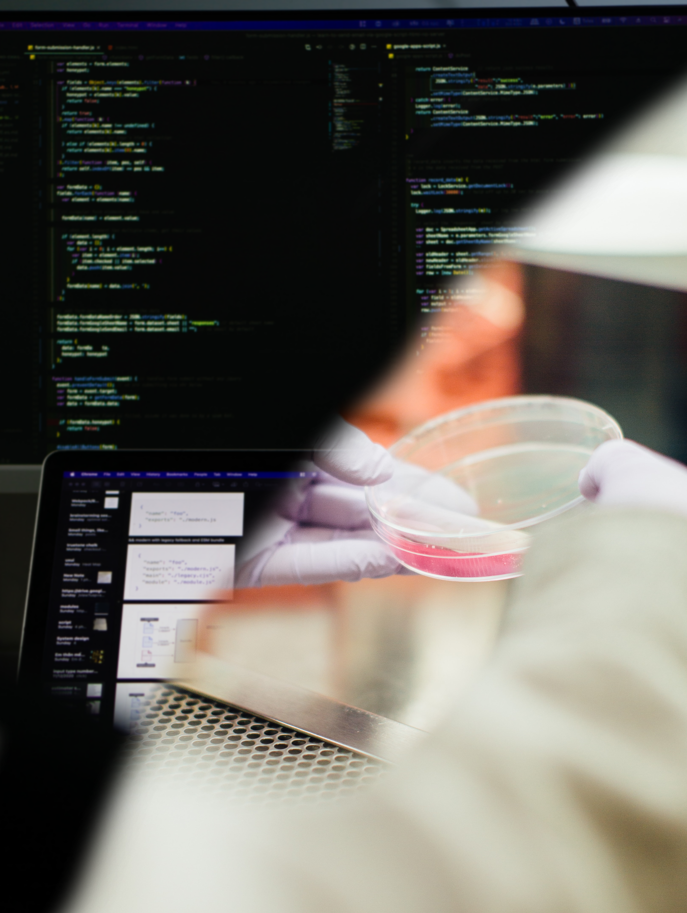

### Welcome / Bienvenido / Bonvenon 👋

I am a young university student (actually pursuing a **biology degree** at
Central University of Venezuela) inclined to understand current facts,
interested in presenting and communicating scientific information to
the public in the most reliable way. I develop my creative side in
conjunction with my research experience to build new knowledge and
provide solutions. Entrepreneur and self-taught, I try to look
beyond the current limits to answer questions that affect our
daily environment.

### Technological tools 👨🏻‍💻
-  R language
-  MS Excel
-  GeoGebra
-  GNU/Linux

### Where can you find me?
- 🌐 [Visit my website](https://itsmiguelrojas.github.io/)
-  [Connect with me in LinkedIn](https://www.linkedin.com/in/itsmiguelrojas/)
-  [See my posts on Instagram](https://www.instagram.com/itsmiguelrojas/)
- [See my notebooks on ](https://www.kaggle.com/itsmiguelrojas)
